# Sequence Diagrams

## UC01 เข้าสู่ระบบ

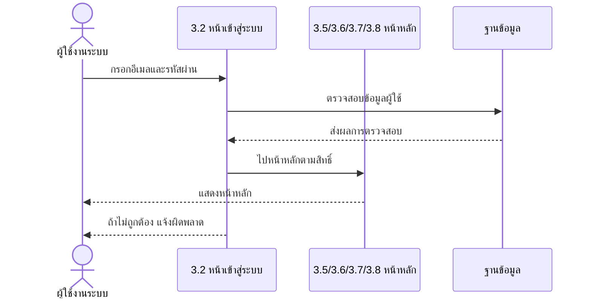
```mermaid
sequenceDiagram
    actor Aactor as ผู้ใช้งานระบบ
    participant Login as 3.2 หน้าเข้าสู่ระบบ
    participant Home as 3.5/3.6/3.7/3.8 หน้าหลัก
    participant DB as ฐานข้อมูล
    Aactor->>Login: กรอกอีเมลและรหัสผ่าน
    Login->>DB: ตรวจสอบข้อมูลผู้ใช้
    DB-->>Login: ส่งผลการตรวจสอบ
    Login->>Home: ไปหน้าหลักตามสิทธิ์
    Home-->>Aactor: แสดงหน้าหลัก
    Login-->>Aactor: ถ้าไม่ถูกต้อง แจ้งผิดพลาด
```

## UC02 ตั้งรหัสผ่านครั้งแรก

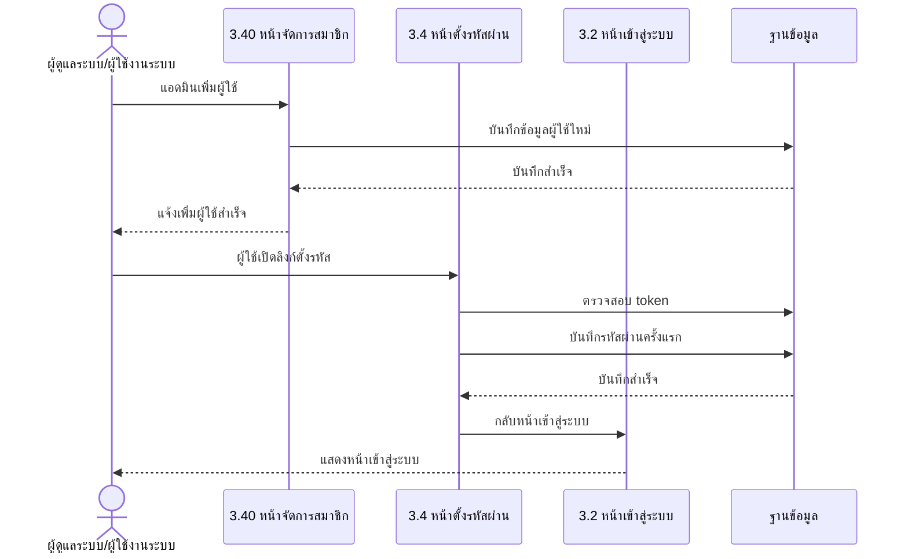
```mermaid
sequenceDiagram
    actor Aactor as ผู้ดูแลระบบ/ผู้ใช้งานระบบ
    participant Users as 3.40 หน้าจัดการสมาชิก
    participant SetPass as 3.4 หน้าตั้งรหัสผ่าน
    participant Login as 3.2 หน้าเข้าสู่ระบบ
    participant DB as ฐานข้อมูล
    Aactor->>Users: แอดมินเพิ่มผู้ใช้
    Users->>DB: บันทึกข้อมูลผู้ใช้ใหม่
    DB-->>Users: บันทึกสำเร็จ
    Users-->>Aactor: แจ้งเพิ่มผู้ใช้สำเร็จ
    Aactor->>SetPass: ผู้ใช้เปิดลิงก์ตั้งรหัส
    SetPass->>DB: ตรวจสอบ token
    SetPass->>DB: บันทึกรหัสผ่านครั้งแรก
    DB-->>SetPass: บันทึกสำเร็จ
    SetPass->>Login: กลับหน้าเข้าสู่ระบบ
    Login-->>Aactor: แสดงหน้าเข้าสู่ระบบ
```

## UC03 เปลี่ยนรหัสผ่าน

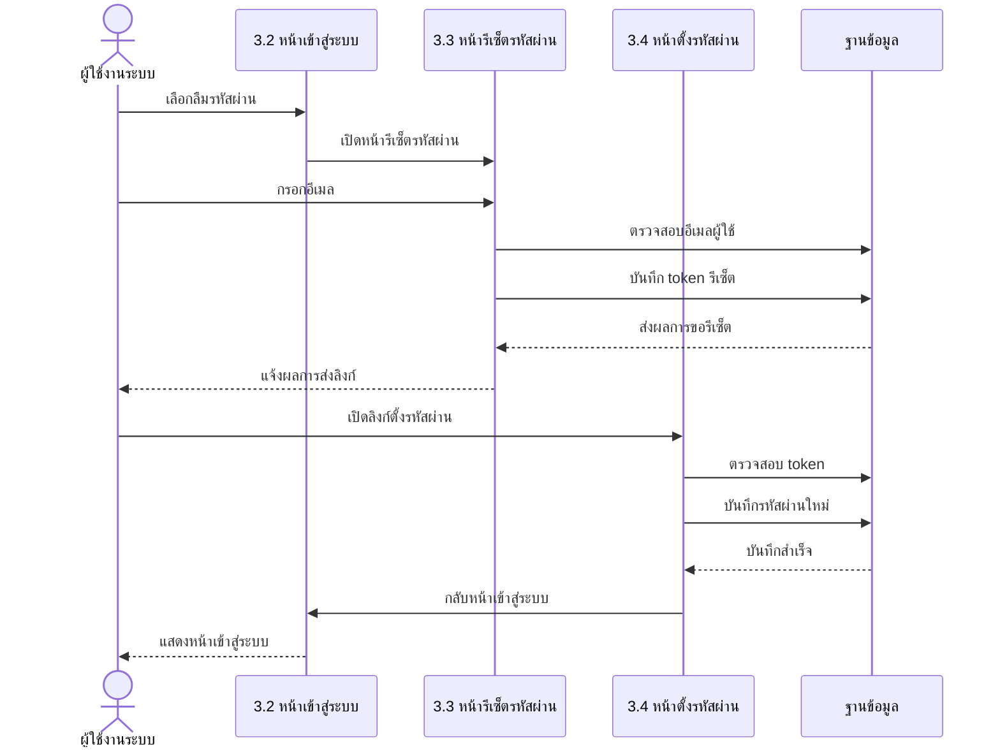
```mermaid
sequenceDiagram
    actor Aactor as ผู้ใช้งานระบบ
    participant Login as 3.2 หน้าเข้าสู่ระบบ
    participant Reset as 3.3 หน้ารีเซ็ตรหัสผ่าน
    participant SetPass as 3.4 หน้าตั้งรหัสผ่าน
    participant DB as ฐานข้อมูล
    Aactor->>Login: เลือกลืมรหัสผ่าน
    Login->>Reset: เปิดหน้ารีเซ็ตรหัสผ่าน
    Aactor->>Reset: กรอกอีเมล
    Reset->>DB: ตรวจสอบอีเมลผู้ใช้
    Reset->>DB: บันทึก token รีเซ็ต
    DB-->>Reset: ส่งผลการขอรีเซ็ต
    Reset-->>Aactor: แจ้งผลการส่งลิงก์
    Aactor->>SetPass: เปิดลิงก์ตั้งรหัสผ่าน
    SetPass->>DB: ตรวจสอบ token
    SetPass->>DB: บันทึกรหัสผ่านใหม่
    DB-->>SetPass: บันทึกสำเร็จ
    SetPass->>Login: กลับหน้าเข้าสู่ระบบ
    Login-->>Aactor: แสดงหน้าเข้าสู่ระบบ
```

## UC04 เพิ่มการแจ้งซ่อม

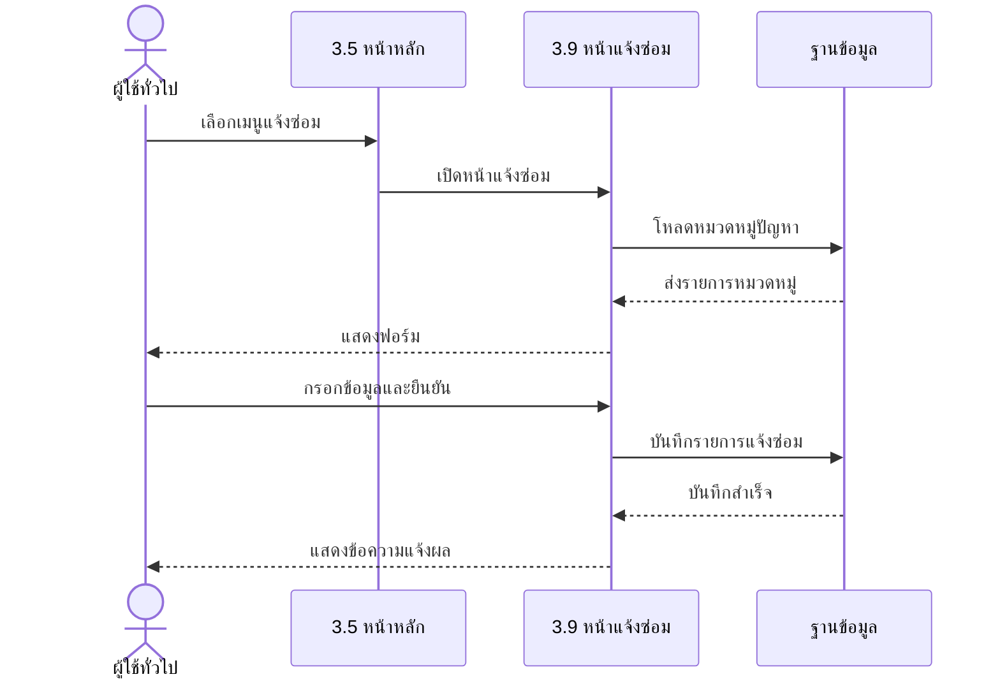
```mermaid
sequenceDiagram
    actor Aactor as ผู้ใช้ทั่วไป
    participant Home as 3.5 หน้าหลัก
    participant Repair as 3.9 หน้าแจ้งซ่อม
    participant DB as ฐานข้อมูล
    Aactor->>Home: เลือกเมนูแจ้งซ่อม
    Home->>Repair: เปิดหน้าแจ้งซ่อม
    Repair->>DB: โหลดหมวดหมู่ปัญหา
    DB-->>Repair: ส่งรายการหมวดหมู่
    Repair-->>Aactor: แสดงฟอร์ม
    Aactor->>Repair: กรอกข้อมูลและยืนยัน
    Repair->>DB: บันทึกรายการแจ้งซ่อม
    DB-->>Repair: บันทึกสำเร็จ
    Repair-->>Aactor: แสดงข้อความแจ้งผล
```

## UC05 ติดตามสถานะการแจ้งซ่อม

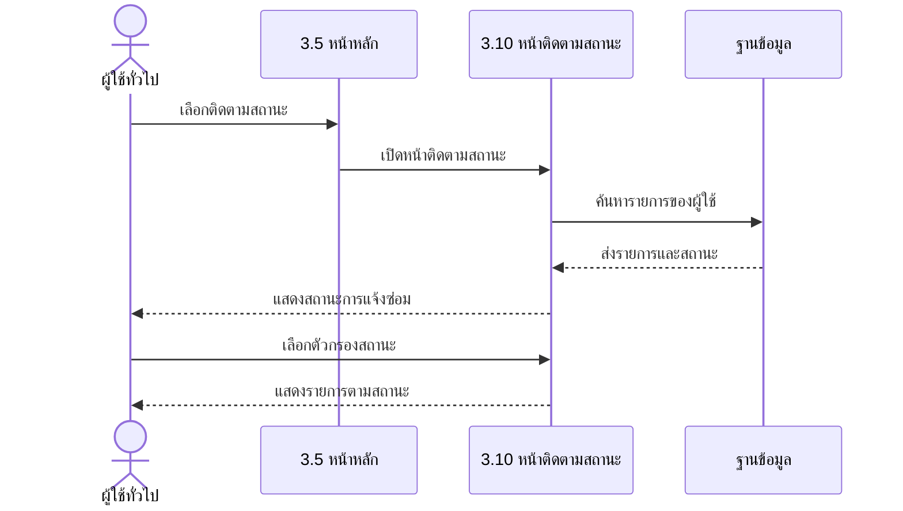
```mermaid
sequenceDiagram
    actor Aactor as ผู้ใช้ทั่วไป
    participant Home as 3.5 หน้าหลัก
    participant Track as 3.10 หน้าติดตามสถานะ
    participant DB as ฐานข้อมูล
    Aactor->>Home: เลือกติดตามสถานะ
    Home->>Track: เปิดหน้าติดตามสถานะ
    Track->>DB: ค้นหารายการของผู้ใช้
    DB-->>Track: ส่งรายการและสถานะ
    Track-->>Aactor: แสดงสถานะการแจ้งซ่อม
    Aactor->>Track: เลือกตัวกรองสถานะ
    Track-->>Aactor: แสดงรายการตามสถานะ
```

## UC06 ดูประวัติการแจ้งซ่อม

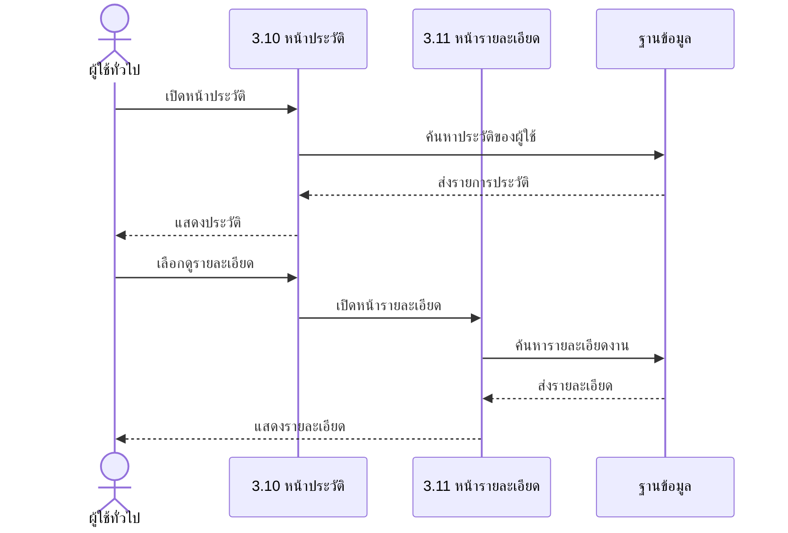
```mermaid
sequenceDiagram
    actor Aactor as ผู้ใช้ทั่วไป
    participant History as 3.10 หน้าประวัติ
    participant Detail as 3.11 หน้ารายละเอียด
    participant DB as ฐานข้อมูล
    Aactor->>History: เปิดหน้าประวัติ
    History->>DB: ค้นหาประวัติของผู้ใช้
    DB-->>History: ส่งรายการประวัติ
    History-->>Aactor: แสดงประวัติ
    Aactor->>History: เลือกดูรายละเอียด
    History->>Detail: เปิดหน้ารายละเอียด
    Detail->>DB: ค้นหารายละเอียดงาน
    DB-->>Detail: ส่งรายละเอียด
    Detail-->>Aactor: แสดงรายละเอียด
```

## UC07 ยืนยันผลการซ่อม

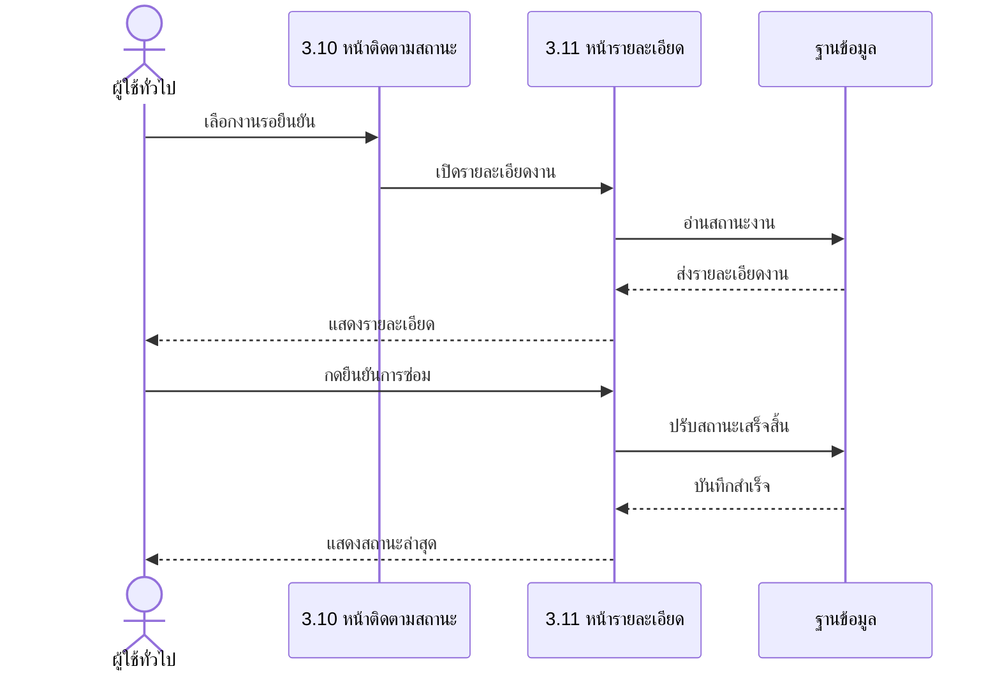
```mermaid
sequenceDiagram
    actor Aactor as ผู้ใช้ทั่วไป
    participant Track as 3.10 หน้าติดตามสถานะ
    participant Detail as 3.11 หน้ารายละเอียด
    participant DB as ฐานข้อมูล
    Aactor->>Track: เลือกงานรอยืนยัน
    Track->>Detail: เปิดรายละเอียดงาน
    Detail->>DB: อ่านสถานะงาน
    DB-->>Detail: ส่งรายละเอียดงาน
    Detail-->>Aactor: แสดงรายละเอียด
    Aactor->>Detail: กดยืนยันการซ่อม
    Detail->>DB: ปรับสถานะเสร็จสิ้น
    DB-->>Detail: บันทึกสำเร็จ
    Detail-->>Aactor: แสดงสถานะล่าสุด
```

## UC08 ดูหน้าประวัติส่วนตัว

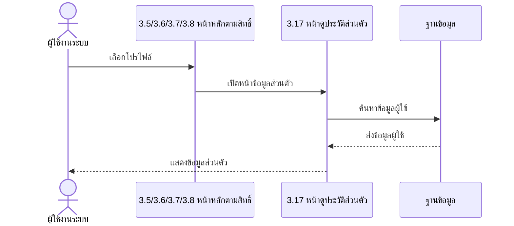
```mermaid
sequenceDiagram
    actor Aactor as ผู้ใช้งานระบบ
    participant Home as 3.5/3.6/3.7/3.8 หน้าหลักตามสิทธิ์
    participant Profile as 3.17 หน้าดูประวัติส่วนตัว
    participant DB as ฐานข้อมูล
    Aactor->>Home: เลือกโปรไฟล์
    Home->>Profile: เปิดหน้าข้อมูลส่วนตัว
    Profile->>DB: ค้นหาข้อมูลผู้ใช้
    DB-->>Profile: ส่งข้อมูลผู้ใช้
    Profile-->>Aactor: แสดงข้อมูลส่วนตัว
```

## UC09 ดูงานซ่อมที่ได้รับมอบหมาย

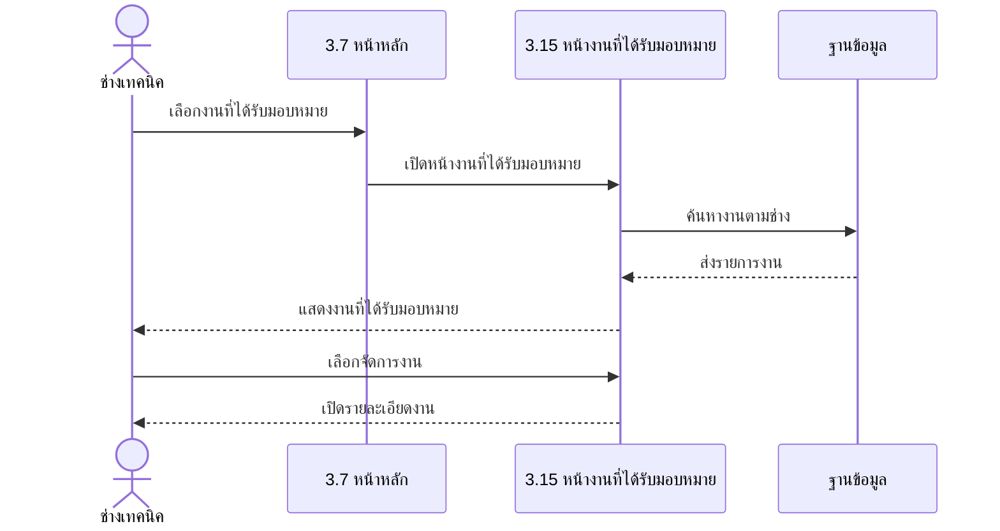
```mermaid
sequenceDiagram
    actor Aactor as ช่างเทคนิค
    participant Home as 3.7 หน้าหลัก
    participant Assigned as 3.15 หน้างานที่ได้รับมอบหมาย
    participant DB as ฐานข้อมูล
    Aactor->>Home: เลือกงานที่ได้รับมอบหมาย
    Home->>Assigned: เปิดหน้างานที่ได้รับมอบหมาย
    Assigned->>DB: ค้นหางานตามช่าง
    DB-->>Assigned: ส่งรายการงาน
    Assigned-->>Aactor: แสดงงานที่ได้รับมอบหมาย
    Aactor->>Assigned: เลือกจัดการงาน
    Assigned-->>Aactor: เปิดรายละเอียดงาน
```

## UC11 ดูประวัติการซ่อมของตนเอง

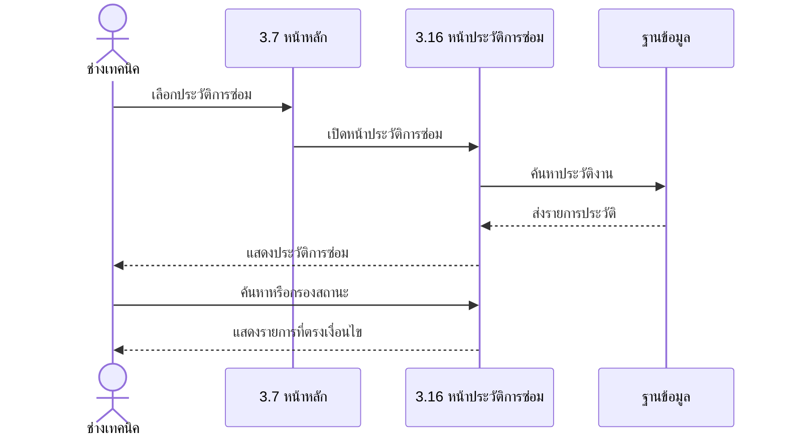
```mermaid
sequenceDiagram
    actor Aactor as ช่างเทคนิค
    participant Home as 3.7 หน้าหลัก
    participant History as 3.16 หน้าประวัติการซ่อม
    participant DB as ฐานข้อมูล
    Aactor->>Home: เลือกประวัติการซ่อม
    Home->>History: เปิดหน้าประวัติการซ่อม
    History->>DB: ค้นหาประวัติงาน
    DB-->>History: ส่งรายการประวัติ
    History-->>Aactor: แสดงประวัติการซ่อม
    Aactor->>History: ค้นหาหรือกรองสถานะ
    History-->>Aactor: แสดงรายการที่ตรงเงื่อนไข
```

## UC12 จัดการรายการอุปกรณ์

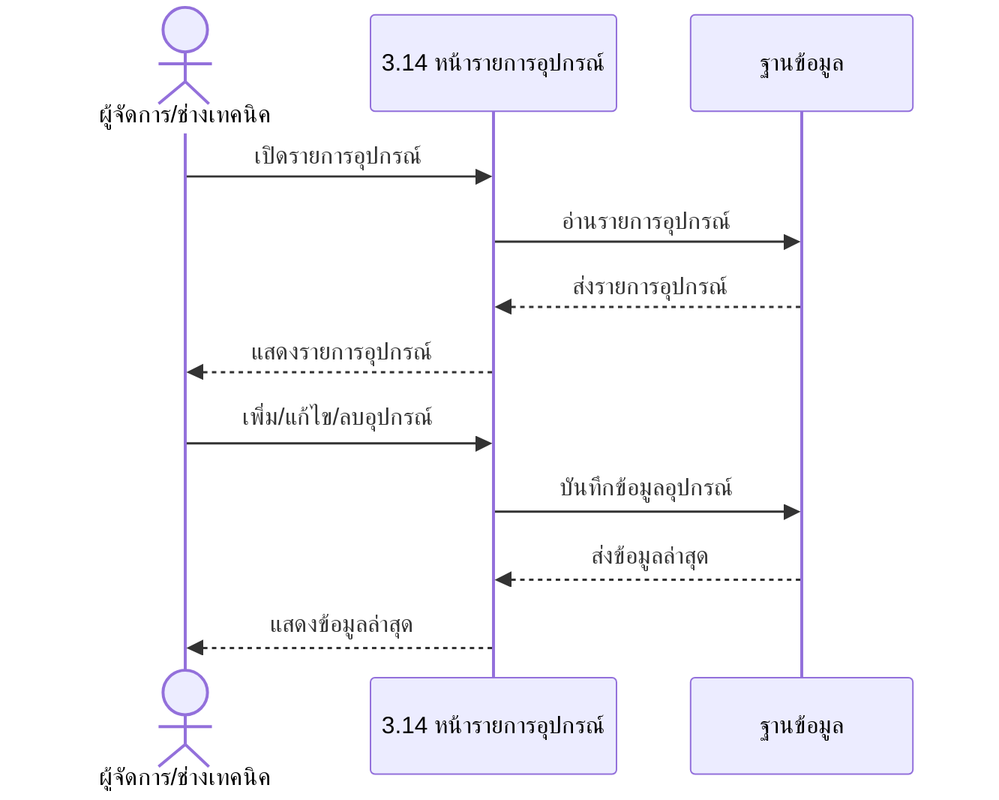
```mermaid
sequenceDiagram
    actor Aactor as ผู้จัดการ/ช่างเทคนิค
    participant Device as 3.14 หน้ารายการอุปกรณ์
    participant DB as ฐานข้อมูล
    Aactor->>Device: เปิดรายการอุปกรณ์
    Device->>DB: อ่านรายการอุปกรณ์
    DB-->>Device: ส่งรายการอุปกรณ์
    Device-->>Aactor: แสดงรายการอุปกรณ์
    Aactor->>Device: เพิ่ม/แก้ไข/ลบอุปกรณ์
    Device->>DB: บันทึกข้อมูลอุปกรณ์
    DB-->>Device: ส่งข้อมูลล่าสุด
    Device-->>Aactor: แสดงข้อมูลล่าสุด
```

## UC13 ดูรายการแจ้งซ่อมทั้งหมด

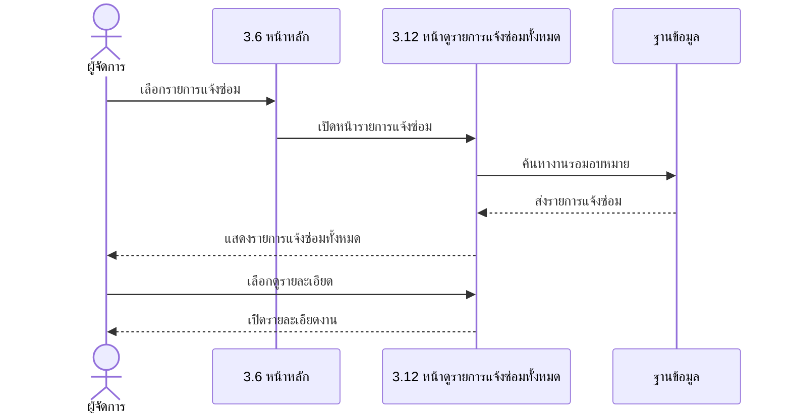
```mermaid
sequenceDiagram
    actor Aactor as ผู้จัดการ
    participant Home as 3.6 หน้าหลัก
    participant List as 3.12 หน้าดูรายการแจ้งซ่อมทั้งหมด
    participant DB as ฐานข้อมูล
    Aactor->>Home: เลือกรายการแจ้งซ่อม
    Home->>List: เปิดหน้ารายการแจ้งซ่อม
    List->>DB: ค้นหางานรอมอบหมาย
    DB-->>List: ส่งรายการแจ้งซ่อม
    List-->>Aactor: แสดงรายการแจ้งซ่อมทั้งหมด
    Aactor->>List: เลือกดูรายละเอียด
    List-->>Aactor: เปิดรายละเอียดงาน
```

## UC17 จัดการข้อมูลสถานะการซ่อม

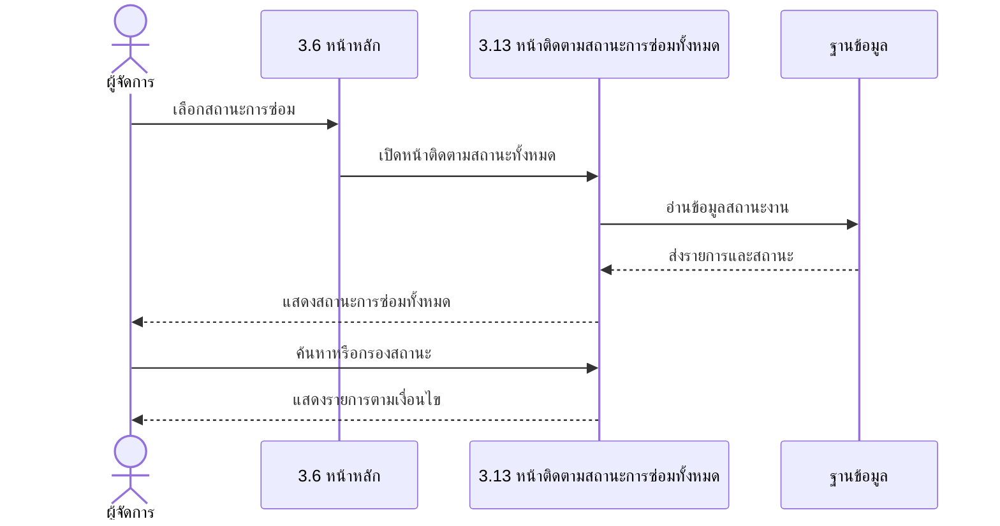
```mermaid
sequenceDiagram
    actor Aactor as ผู้จัดการ
    participant Home as 3.6 หน้าหลัก
    participant Status as 3.13 หน้าติดตามสถานะการซ่อมทั้งหมด
    participant DB as ฐานข้อมูล
    Aactor->>Home: เลือกสถานะการซ่อม
    Home->>Status: เปิดหน้าติดตามสถานะทั้งหมด
    Status->>DB: อ่านข้อมูลสถานะงาน
    DB-->>Status: ส่งรายการและสถานะ
    Status-->>Aactor: แสดงสถานะการซ่อมทั้งหมด
    Aactor->>Status: ค้นหาหรือกรองสถานะ
    Status-->>Aactor: แสดงรายการตามเงื่อนไข
```

## UC10 บันทึกผลการซ่อม

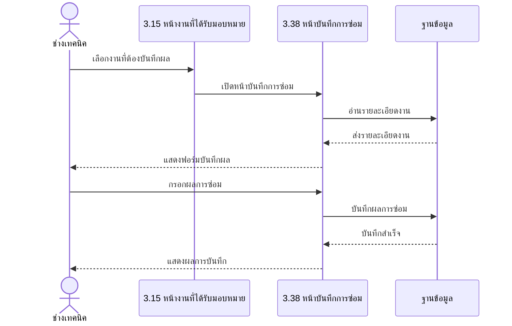
```mermaid
sequenceDiagram
    actor Aactor as ช่างเทคนิค
    participant Assigned as 3.15 หน้างานที่ได้รับมอบหมาย
    participant Record as 3.38 หน้าบันทึกการซ่อม
    participant DB as ฐานข้อมูล
    Aactor->>Assigned: เลือกงานที่ต้องบันทึกผล
    Assigned->>Record: เปิดหน้าบันทึกการซ่อม
    Record->>DB: อ่านรายละเอียดงาน
    DB-->>Record: ส่งรายละเอียดงาน
    Record-->>Aactor: แสดงฟอร์มบันทึกผล
    Aactor->>Record: กรอกผลการซ่อม
    Record->>DB: บันทึกผลการซ่อม
    DB-->>Record: บันทึกสำเร็จ
    Record-->>Aactor: แสดงผลการบันทึก
```

## UC14 มอบหมายงานให้ช่าง

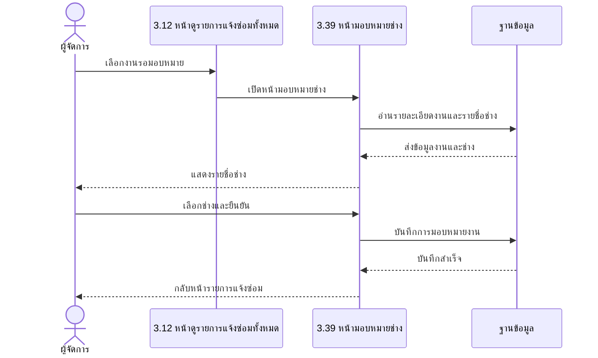
```mermaid
sequenceDiagram
    actor Aactor as ผู้จัดการ
    participant List as 3.12 หน้าดูรายการแจ้งซ่อมทั้งหมด
    participant Assign as 3.39 หน้ามอบหมายช่าง
    participant DB as ฐานข้อมูล
    Aactor->>List: เลือกงานรอมอบหมาย
    List->>Assign: เปิดหน้ามอบหมายช่าง
    Assign->>DB: อ่านรายละเอียดงานและรายชื่อช่าง
    DB-->>Assign: ส่งข้อมูลงานและช่าง
    Assign-->>Aactor: แสดงรายชื่อช่าง
    Aactor->>Assign: เลือกช่างและยืนยัน
    Assign->>DB: บันทึกการมอบหมายงาน
    DB-->>Assign: บันทึกสำเร็จ
    Assign-->>Aactor: กลับหน้ารายการแจ้งซ่อม
```

## UC15 จัดการข้อมูลผู้ใช้

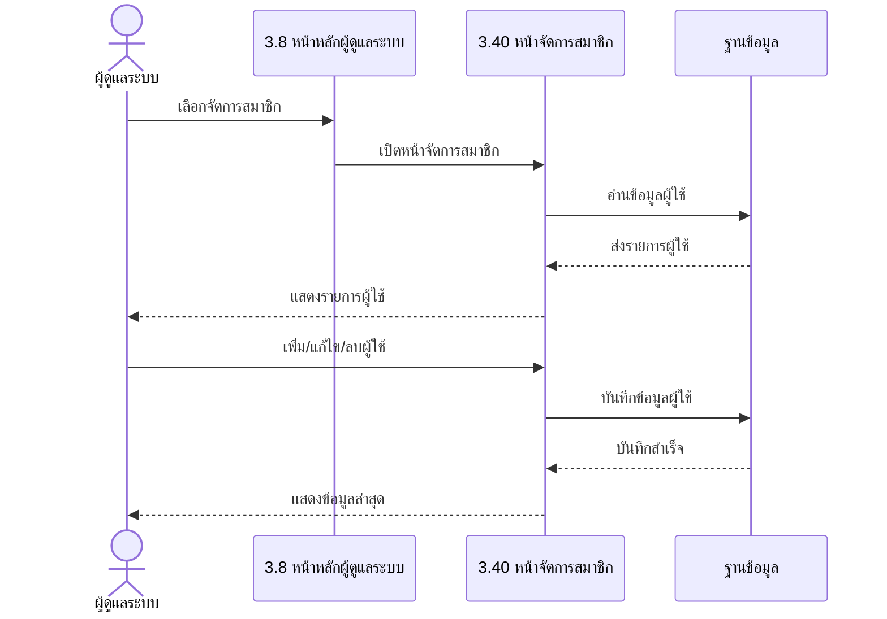
```mermaid
sequenceDiagram
    actor Aactor as ผู้ดูแลระบบ
    participant Home as 3.8 หน้าหลักผู้ดูแลระบบ
    participant Users as 3.40 หน้าจัดการสมาชิก
    participant DB as ฐานข้อมูล
    Aactor->>Home: เลือกจัดการสมาชิก
    Home->>Users: เปิดหน้าจัดการสมาชิก
    Users->>DB: อ่านข้อมูลผู้ใช้
    DB-->>Users: ส่งรายการผู้ใช้
    Users-->>Aactor: แสดงรายการผู้ใช้
    Aactor->>Users: เพิ่ม/แก้ไข/ลบผู้ใช้
    Users->>DB: บันทึกข้อมูลผู้ใช้
    DB-->>Users: บันทึกสำเร็จ
    Users-->>Aactor: แสดงข้อมูลล่าสุด
```

## UC16 จัดการข้อมูลประเภทอุปกรณ์

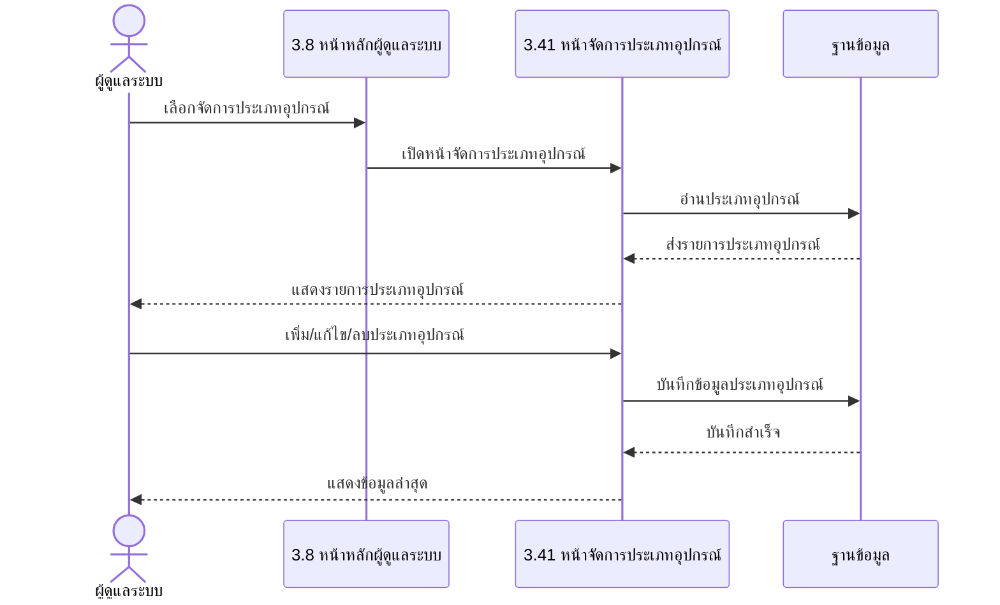
```mermaid
sequenceDiagram
    actor Aactor as ผู้ดูแลระบบ
    participant Home as 3.8 หน้าหลักผู้ดูแลระบบ
    participant Types as 3.41 หน้าจัดการประเภทอุปกรณ์
    participant DB as ฐานข้อมูล
    Aactor->>Home: เลือกจัดการประเภทอุปกรณ์
    Home->>Types: เปิดหน้าจัดการประเภทอุปกรณ์
    Types->>DB: อ่านประเภทอุปกรณ์
    DB-->>Types: ส่งรายการประเภทอุปกรณ์
    Types-->>Aactor: แสดงรายการประเภทอุปกรณ์
    Aactor->>Types: เพิ่ม/แก้ไข/ลบประเภทอุปกรณ์
    Types->>DB: บันทึกข้อมูลประเภทอุปกรณ์
    DB-->>Types: บันทึกสำเร็จ
    Types-->>Aactor: แสดงข้อมูลล่าสุด
```

## UC18 จัดการข้อมูลบทบาท

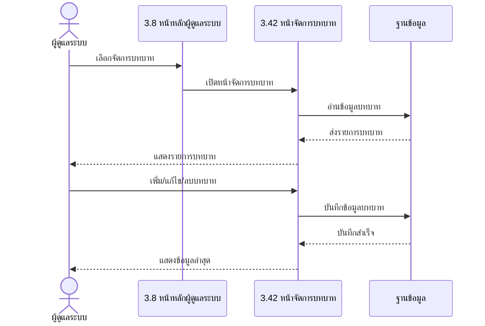
```mermaid
sequenceDiagram
    actor Aactor as ผู้ดูแลระบบ
    participant Home as 3.8 หน้าหลักผู้ดูแลระบบ
    participant Roles as 3.42 หน้าจัดการบทบาท
    participant DB as ฐานข้อมูล
    Aactor->>Home: เลือกจัดการบทบาท
    Home->>Roles: เปิดหน้าจัดการบทบาท
    Roles->>DB: อ่านข้อมูลบทบาท
    DB-->>Roles: ส่งรายการบทบาท
    Roles-->>Aactor: แสดงรายการบทบาท
    Aactor->>Roles: เพิ่ม/แก้ไข/ลบบทบาท
    Roles->>DB: บันทึกข้อมูลบทบาท
    DB-->>Roles: บันทึกสำเร็จ
    Roles-->>Aactor: แสดงข้อมูลล่าสุด
```

## UC19 จัดการข้อมูลแผนก

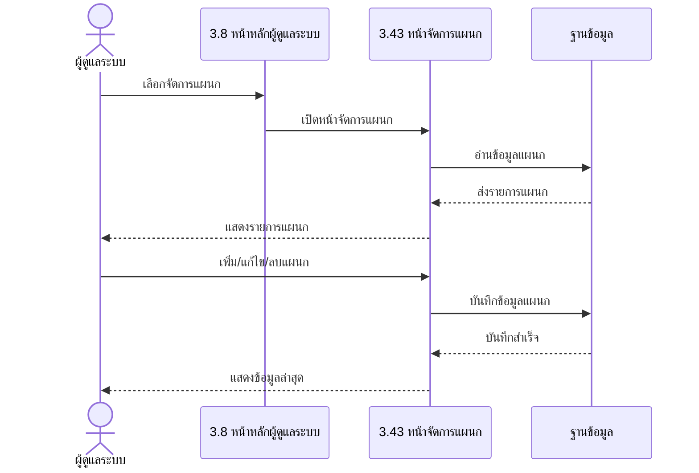
```mermaid
sequenceDiagram
    actor Aactor as ผู้ดูแลระบบ
    participant Home as 3.8 หน้าหลักผู้ดูแลระบบ
    participant Departments as 3.43 หน้าจัดการแผนก
    participant DB as ฐานข้อมูล
    Aactor->>Home: เลือกจัดการแผนก
    Home->>Departments: เปิดหน้าจัดการแผนก
    Departments->>DB: อ่านข้อมูลแผนก
    DB-->>Departments: ส่งรายการแผนก
    Departments-->>Aactor: แสดงรายการแผนก
    Aactor->>Departments: เพิ่ม/แก้ไข/ลบแผนก
    Departments->>DB: บันทึกข้อมูลแผนก
    DB-->>Departments: บันทึกสำเร็จ
    Departments-->>Aactor: แสดงข้อมูลล่าสุด
```

## UC20 จัดการข้อมูลประเภทปัญหา

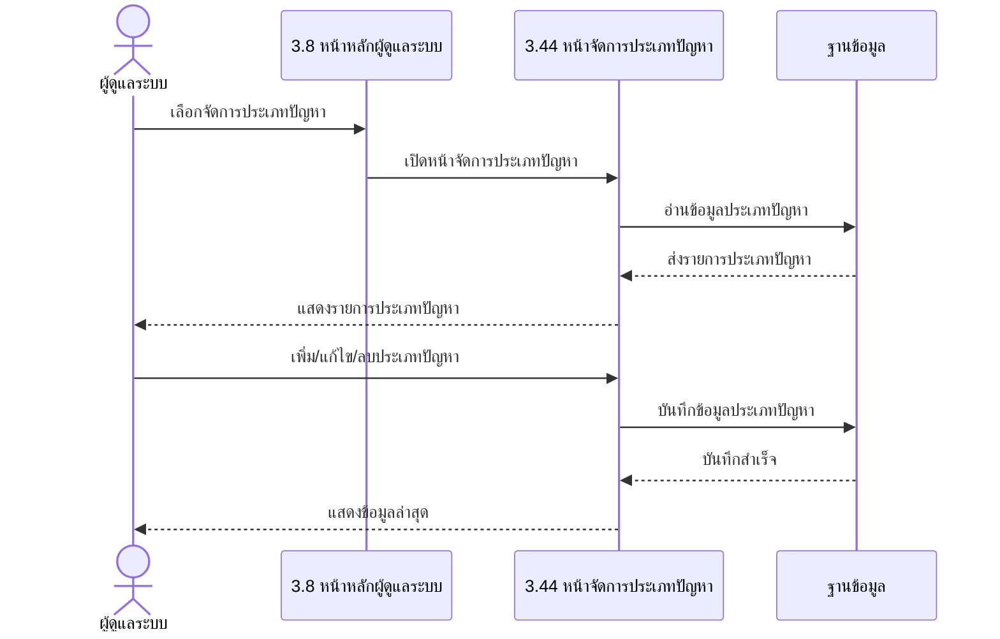
```mermaid
sequenceDiagram
    actor Aactor as ผู้ดูแลระบบ
    participant Home as 3.8 หน้าหลักผู้ดูแลระบบ
    participant Issues as 3.44 หน้าจัดการประเภทปัญหา
    participant DB as ฐานข้อมูล
    Aactor->>Home: เลือกจัดการประเภทปัญหา
    Home->>Issues: เปิดหน้าจัดการประเภทปัญหา
    Issues->>DB: อ่านข้อมูลประเภทปัญหา
    DB-->>Issues: ส่งรายการประเภทปัญหา
    Issues-->>Aactor: แสดงรายการประเภทปัญหา
    Aactor->>Issues: เพิ่ม/แก้ไข/ลบประเภทปัญหา
    Issues->>DB: บันทึกข้อมูลประเภทปัญหา
    DB-->>Issues: บันทึกสำเร็จ
    Issues-->>Aactor: แสดงข้อมูลล่าสุด
```
